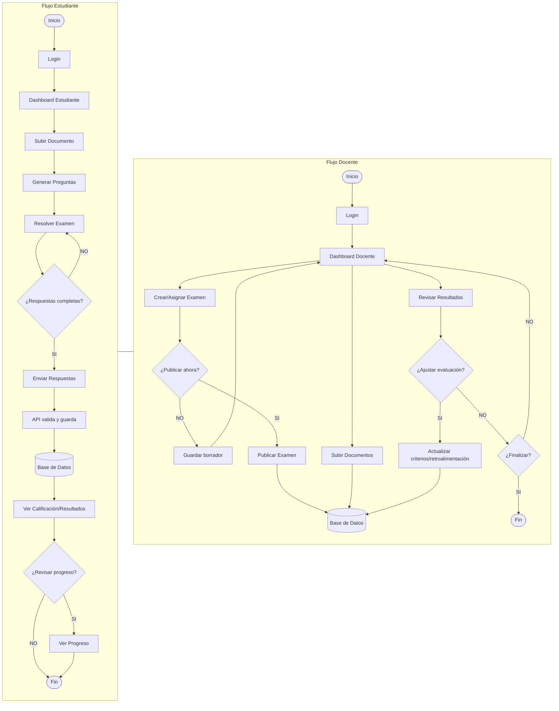

# Diagrama de Procesos de la Plataforma

Flujos completos para Estudiante y Docente con inicio y fin, incluyendo decisiones y bucles.

```mermaid
flowchart LR
    %% =========================
    %% Estudiante
    %% =========================
    subgraph EST[Flujo Estudiante]
        S0([Inicio]) --> S1[Login]
        S1 --> S2[Dashboard Estudiante]
        S2 --> S3[Subir Documento]
        S3 --> S4[Generar Preguntas]
        S4 --> S5[Resolver Examen]
        S5 --> S6{¿Respuestas completas?}
        S6 -- NO --> S5
        S6 -- SI --> S7[Enviar Respuestas]
        S7 --> S8[API valida y guarda]
        S8 --> S9[(Base de Datos)]
        S9 --> S10[Ver Calificación/Resultados]
        S10 --> S11{¿Revisar progreso?}
        S11 -- SI --> S12[Ver Progreso]
        S11 -- NO --> S13([Fin])
        S12 --> S13
    end

    %% Espaciado entre subgrafos
    EST --- DOC

    %% =========================
    %% Docente
    %% =========================
    subgraph DOC[Flujo Docente]
        T0([Inicio]) --> T1[Login]
        T1 --> T2[Dashboard Docente]
        T2 --> T4[Crear/Asignar Examen]
        T4 --> T5{¿Publicar ahora?}
        T5 -- NO --> T6[Guardar borrador]
        T6 --> T2
        T5 -- SI --> T7[Publicar Examen]
        T7 --> T8[(Base de Datos)]
        T2 --> T9[Subir Documentos]
        T9 --> T8
        T2 --> T10[Revisar Resultados]
        T10 --> T11{¿Ajustar evaluación?}
        T11 -- SI --> T12[Actualizar criterios/retroalimentación]
        T12 --> T8
        T11 -- NO --> T13{¿Finalizar?}
        T13 -- SI --> T14([Fin])
        T13 -- NO --> T2
    end
```
